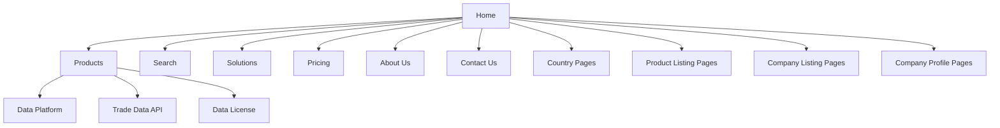

# Information Architecture Diagram

## Sitemap Structure

## Navigation Hierarchy
1. Home
   - Products
     - Data Platform
     - Trade Data API
     - Data License
   - Search
   - Solutions
   - Pricing
   - About Us
   - Contact Us
   - Country Pages
   - Product Listing Pages
   - Company Listing Pages
   - Company Profile Pages

## User Flows
- **User Accessing Main Page**: 
  - Starts at Home 
  - Navigates to Products or other sections as needed

- **User Searching for Products**: 
  - Uses Search feature from Home 
  - Filters by Categories (Products)

- **User Interested in Company Information**: 
  - Navigates to Company Listing Pages 
  - Selects a specific Company Profile

## Content Relationships
- **Products** are central to user interactions
- **About Us** and **Contact Us** provide supporting information and ethos of the company.
- **Country Pages** link to localized product offerings.
- **Listing Pages** provide pathways to detailed information on specific Products or Companies.
